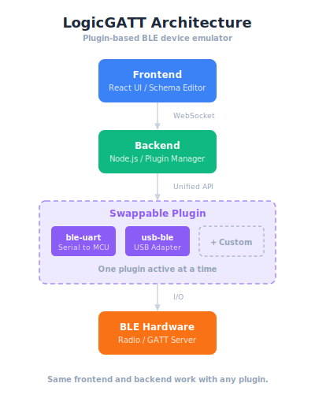

# LogicGATT

A programmable BLE device emulator. Design GATT schemas in a web UI and define custom logic to respond to BLE operations—without reflashing firmware.

> **Disclaimer:** I have no prior experience with open source projects and my expertise in these domains is limited. This project has only been tested on Windows 11, is in early development, and most certainly contains bugs and vulnerabilities. Use at your own risk.

## Prerequisites

### Using mise (Recommended)

This project uses [mise](https://mise.jdx.dev/) to manage tool versions consistently across environments.

1. [Install mise](https://mise.jdx.dev/getting-started.html) for your platform
2. Set up the project environment:
   ```bash
   mise trust             # Trust this project's .mise.toml
   mise install           # Install required Node.js and Python versions
   ```

### Manual Setup

If you prefer not to use mise, ensure you have:

| Tool | Version | Purpose |
|------|---------|---------|
| [Node.js](https://nodejs.org/) | >= 18 | Backend server and frontend build |
| [Python](https://www.python.org/) | >= 3.10 | usb-ble plugin backend |
| [Make](https://www.gnu.org/software/make/) | any | Build orchestration |

### Plugin-Specific Requirements

Depending on which connectivity backend you use:

- **ble-uart plugin**: Firmware for your MCU (reference ESP32 firmware included)
- **usb-ble plugin**: Python >= 3.10 with pip (dependencies installed automatically)

### Browser Requirements

Modern browser with WebSocket support (Chrome, Firefox, Edge, Safari)

## Features

- **Dynamic GATT Schema** — Define services and characteristics with custom UUIDs
- **Scenario-based Logic** — Event-driven pipelines triggered by BLE reads, writes, timers
- **Sandboxed Functions** — JavaScript functions execute in a secure Web Worker
- **Multiple Backends** — Connect via MCU over UART or PC Bluetooth adapter

## Architecture

<p align="center">
  
</p>

## Quick Start

```bash
# 1. Clone the repository
git clone https://github.com/user/logic-gatt.git
cd logic-gatt

# 2. Set up tools (if using mise)
mise trust && mise install

# 3. Install dependencies
make install

# 4. Start dev servers (run in separate terminals)
make dev-backend    # http://localhost:3001
make dev-frontend   # http://localhost:5173
```

Open http://localhost:5173 in a supported browser (Chrome/Edge/Opera).

## Project Structure

```
logic-gatt/
├── frontend/              # React web app (Vite)
├── backend/               # Node.js server
│   └── plugins/           # Connection backends
│       ├── ble-uart/      # MCU via USB-UART (includes ESP32 reference firmware)
│       └── usb-ble/       # PC Bluetooth adapter (includes python/)
└── shared/                # Shared TypeScript types
```

## Make Targets

| Target | Description |
|--------|-------------|
| `make install` | Install all dependencies |
| `make build` | Build for production |
| `make dev-backend` | Start backend dev server |
| `make dev-frontend` | Start frontend dev server |
| `make start` | Run production server |
| `make clean` | Clean build artifacts |

## Documentation

| Document | Path |
|----------|------|
| **Frontend** | |
| React App | [frontend/README.md](frontend/README.md) |
| Logic Constructor | [frontend/docs/LOGIC_CONSTRUCTOR.md](frontend/docs/LOGIC_CONSTRUCTOR.md) |
| **Backend** | |
| Server | [backend/README.md](backend/README.md) |
| Plugin Development | [backend/plugins/README.md](backend/plugins/README.md) |
| **ble-uart Plugin** | |
| UART Transport Library | [backend/plugins/ble-uart/misc/uart_transport_protocol/README.md](backend/plugins/ble-uart/misc/uart_transport_protocol/README.md) |
| Protocol Specification | [backend/plugins/ble-uart/misc/uart_transport_protocol/PROTOCOL.md](backend/plugins/ble-uart/misc/uart_transport_protocol/PROTOCOL.md) |
| ESP32 Firmware (Example) | [backend/plugins/ble-uart/misc/firmware/README.md](backend/plugins/ble-uart/misc/firmware/README.md) |
| Debug Serial Utility | [backend/plugins/ble-uart/misc/firmware/utils/debug_serial/README.md](backend/plugins/ble-uart/misc/firmware/utils/debug_serial/README.md) |
| **usb-ble Plugin** | |
| Python Backend | [backend/plugins/usb-ble/python/README.md](backend/plugins/usb-ble/python/README.md) |
| **Shared** | |
| TypeScript Types | [shared/README.md](shared/README.md) |

## License

MIT
